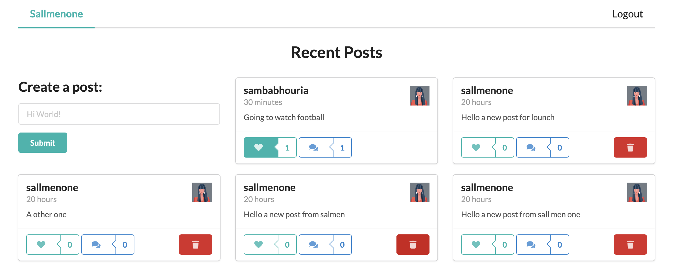
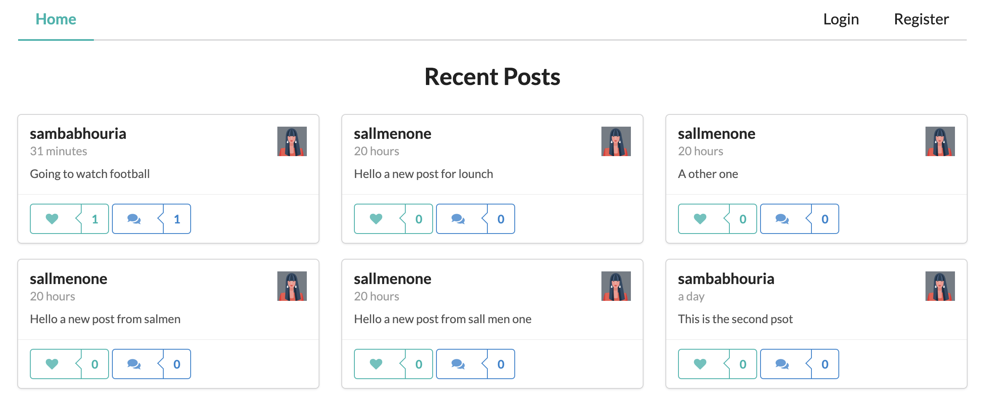
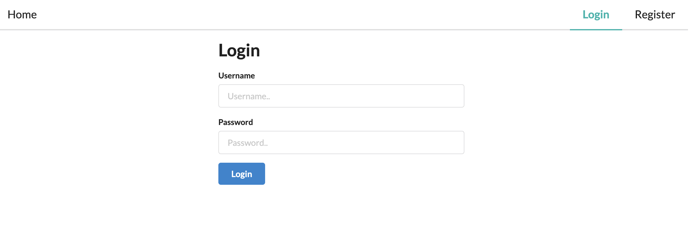
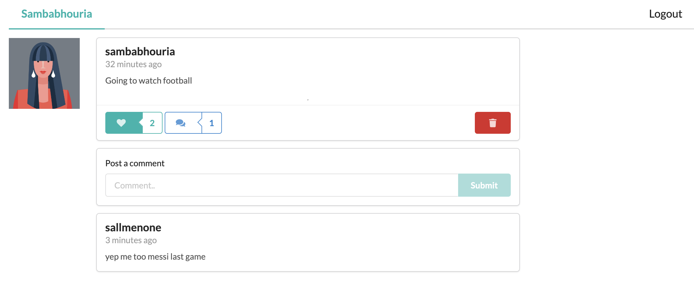

# Social Media App

A social media app using MongoDB, Express, Node, React, GraphQL, and Node.
In this repos how to implement a GraphQL server that uses Node and Express to communicate to a MongoDB Database and fetch and persist data to a social media app back-end.

👉 🌏 ![demo-on-render.com] :()

# Add middleware link for deploy :

https://www.apollographql.com/docs/apollo-server/v2/integrations/middleware/

# Migration :

https://www.apollographql.com/docs/apollo-server/migration/

⭐️ Contents ⭐️

⌨️ Setting Up Database & Server
⌨️ Register & Login Users
⌨️ Authentication middleware & Create/Delete posts
⌨️ Client start & Apollo setup
⌨️ Semantic UI & Routes
⌨️ Displaying posts
⌨️ Login & Register pages
⌨️ Authentication Context
⌨️ Adding posts
⌨️ Like Button
⌨️ Single post page
⌨️ Displaying, Adding & Deleting Comments
⌨️ Info Popups

# Demo Website

# 💻 Screen Shoot 💻

